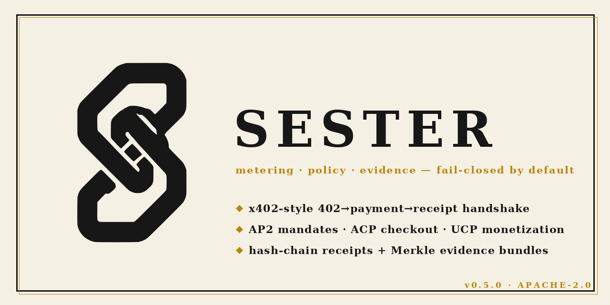

# SESTER — Metering, Quota, Fail-Closed Policy & Verifiable Receipts for AI-Agent APIs

<!-- v2 Chain-S markası (aday-E; potrace IoU 0.9924) — açık/koyu tema-uyumlu -->
<div align="left">
<picture><source media="(prefers-color-scheme: dark)" srcset="data:image/svg+xml;base64,PHN2ZyB4bWxucz0iaHR0cDovL3d3dy53My5vcmcvMjAwMC9zdmciIHZpZXdCb3g9IjAgMCAyMDAgMjAwIj48cmVjdCB3aWR0aD0iMjAwIiBoZWlnaHQ9IjIwMCIgcng9IjI4IiBmaWxsPSIjMTcxNzE3Ii8+PGcgdHJhbnNmb3JtPSJ0cmFuc2xhdGUoNjUuNiwwKSBzY2FsZSgwLjE4OTQpIHRyYW5zbGF0ZSgwLDEwNTYpIHNjYWxlKDAuMSwtMC4xKSIgZmlsbD0iI0Y1RjBFNCIgc3Ryb2tlPSJub25lIj48cGF0aCBkPSJNMjk0MCAxMDIxMCBjLTYzIC0xNSAtMTQwIC0zOCAtMTcwIC01MCAtMzAgLTEyIC03MSAtMjggLTkwIC0zNSAtMTkKLTggLTU1IC0yNSAtODAgLTM5IC0yNSAtMTQgLTYzIC0zNSAtODUgLTQ3IC0yMiAtMTIgLTEzNyAtMTE3IC0yNTUgLTIzMyAtMTE4Ci0xMTYgLTMzOCAtMzMyIC00OTAgLTQ4MSAtNDM3IC00MjggLTExOTEgLTExODUgLTEyNDAgLTEyNDUgLTQ1IC01NSAtNTMgLTY3Ci05NyAtMTUwIC0zMCAtNTUgLTQ2IC05OCAtODEgLTIxNSBsLTI3IC05MCAwIC02NzUgYzEgLTY2NSAxIC02NzYgMjMgLTc1MyAyMgotODEgMTE1IC0yODAgMTY0IC0zNTQgMzYgLTUzIDI1NjIgLTI1NzUgMjY0NyAtMjY0MyA3MSAtNTYgMTY5IC0xMDYgMjc2IC0xNDAKMTA2IC0zNCAzMTAgLTQwIDQyNCAtMTEgMTY0IDQxIDI3MCAxMDkgNDU5IDI5NSAxNDIgMTM5IDE1MyAxNTYgMjAzIDMxMSAxNwo1NSAxOSA5MyAxOSA0NDYgbDAgMzg1IC0yNSA1MCBjLTE2IDMxIC04NiAxMTYgLTE4NCAyMjAgLTE5MyAyMDcgLTI3NCAyODQKLTI5NyAyODQgLTQ1IDAgLTQzNCAtMzc4IC00MzQgLTQyMiAxIC0xMyAyMSAtNDggNDUgLTc4IDEyNyAtMTU2IDE0NyAtMjEzCjEwNSAtMjg5IC0yNiAtNDUgLTQzIC01NSAtNjggLTQyIC0xOCAxMCAtNTE4IDUxMiAtODAyIDgwNiAtNTA3IDUyNCAtNjcwIDY5NAotNjk2IDcyNSAtMzAgMzcgLTQyNCA0NDkgLTUxMCA1MzUgLTI4IDI3IC04NSA4MyAtMTI3IDEyMiAtMTE4IDExMyAtMTExIDgwCi0xMTcgNTAzIC03IDQ3OSAtMTIgNDYxIDE0OSA2MTUgNTIgNTAgMTQyIDEzOCAyMDAgMTk2IDU4IDU5IDI2OCAyNjYgNDY2IDQ2MAo1OTIgNTgyIDc1NyA3NDUgODA5IDc5OSA1NSA1OCAxMTAgOTYgMTUzIDEwNSAxNSA0IDQ1IDEzIDY2IDIxIDMxIDEyIDE4NyAxNAo5NDYgMTQgbDkwOSAwIDQ4IC0zMiBjOTMgLTYzIDg5IC0zOSA4OSAtNTc0IDAgLTMxNiAtMyAtNDc1IC0xMSAtNDg3IC0xMSAtMTkKLTM4MiAtMzk1IC01MjcgLTUzNCAtNDcgLTQ2IC05MyAtODMgLTEwMSAtODMgLTggMCAtNTQgNDMgLTEwMyA5NSAtNDggNTMKLTExMiAxMTQgLTE0MSAxMzYgLTYwIDQ2IC0xODMgOTMgLTIxOSA4NCAtMTQgLTMgLTYwIDkgLTEyNSAzNSAtNTcgMjIgLTEzMgo0NiAtMTY4IDU0IC0zNiA4IC0xMDUgMjQgLTE1NSAzNiAtMTA4IDI2IC0zNzcgMzggLTQ2NyAyMiAtNzAgLTE0IC0yOTggLTEyMwotMzU4IC0xNzMgLTI1IC0yMCAtNzAgLTUwIC0xMDAgLTY2IC0xMTQgLTYwIC0xMjcgLTcxIC0zMzQgLTI2NyAtMTg2IC0xNzYKLTIzMyAtMjQ1IC0yNjEgLTM3NyAtMTIgLTYwIC0xNSAtMTUyIC0xNSAtNDc0IDAgLTQ1NCAtNyAtNDExIDkwIC01MjAgMTY2Ci0xODUgNDMzIC00NjAgNDYxIC00NzYgMTggLTkgMzYgNSAxNjEgMTI4IDI1NSAyNTEgMzA4IDMwOCAzMDggMzMyIDAgMTUgLTI2CjUxIC03MSA5OSAtMTI3IDEzNiAtMTU2IDE5NyAtMTMwIDI3NSAxNiA0OCA0MCA2NyA5NyA3MyBsNDkgNiA0NSAtNjggYzU3IC04NwoxMjEgLTE2MyAyMDAgLTIzOSAzNCAtMzMgMTA1IC0xMTQgMTU4IC0xODAgMTQ4IC0xODYgMjExIC0yNTYgNDA1IC00NTQgOTgKLTEwMSAyMTIgLTIyNSAyNTIgLTI3NSAzOSAtNTAgMTU3IC0xODAgMjYxIC0yODkgMTA0IC0xMDkgMjYzIC0yODAgMzU0IC0zODEKOTEgLTEwMSAyMTkgLTI0MCAyODUgLTMxMCAxNzUgLTE4NCAxNjYgLTE1MyAxNjQgLTU5NiAtMSAtMjcwIC01IC0zNjggLTE2Ci00MDggLTE0IC01MiAtMzMgLTcyIC04NTcgLTg5MyAtNjkxIC02ODkgLTg1MiAtODQ1IC04OTcgLTg2NyBsLTU0IC0yNyAtOTIzCi0zIGMtNjM1IC0yIC05MzYgMSAtOTYzIDggLTU5IDE2IC0xMTYgNzIgLTEyNiAxMjMgLTQgMjMgLTYgMjQ5IC0zIDUwMyBsNQo0NjEgMzYgNDQgYzIxIDI0IDEyNSAxMzMgMjMyIDI0MyBsMTk1IDE5OCA2NCAtMTEgYzQxIC03IDc1IC04IDk2IC0xIDc3IDIxCjI5NCAyMDggMzY4IDMxNiAzNyA1MyAzNyA1NiAyNCA5MiAtNyAyMCAtMTIgNTUgLTExIDc4IDMgNTcgLTEyIDczIC00MjIgNDg2Ci0zMjQgMzI3IC0zNDcgMzQ4IC0zODEgMzQ4IC0zMSAwIC00OSAtMTMgLTE0OCAtMTA1IC0xNzMgLTE2MiAtMjM1IC0yMjIgLTMzMwotMzI1IC01MCAtNTIgLTE5NiAtMTk4IC0zMjQgLTMyNSAtMzY2IC0zNjEgLTQxMSAtNDI1IC00ODggLTcwNSAtMTYgLTU5IC0xOAotMTI5IC0yMSAtNzkyIC0yIC00MDcgMSAtNzU1IDYgLTc5MCAyOCAtMTg2IDExMCAtMzcwIDIzNSAtNTIxIDExNCAtMTM4IDE1NQotMTc0IDI3MiAtMjQ4IDE3NSAtMTEwIDMxMCAtMTYyIDQ4MyAtMTg4IDEwMCAtMTUgMjI3OSAtMTUgMjM3MSAwIDEyNiAyMCAyNTEKNjEgMzYxIDExOCAxMzQgNzAgMTg0IDExNSA3MzEgNjU4IDE0MjMgMTQxMyAxMzY3IDEzNTQgMTQ2MSAxNTA5IDI5IDQ2IDY2CjEzNSA5MSAyMTkgMzUgMTE0IDM5IDIwNyAzNSA4NTAgbC00IDYzMCAtMjYgODIgYy0zNyAxMTMgLTk4IDI0MiAtMTU0IDMyMQotMjYgMzcgLTExMSAxMzAgLTE4OCAyMDcgLTI0NSAyNDMgLTUyNCA1MzUgLTU3OCA2MDIgLTI1IDMyIC0yOCA0NCAtMjggMTA4IDAKODMgLTI5IDIzMyAtNjAgMzE1IC00MSAxMDYgLTEzNSAyODAgLTE2MCAyOTUgLTUgMyAtMTAgMTUgLTEwIDI2IDAgNDkgMTEwCjE2NiA2NzMgNzEzIDE5NyAxOTEgMzUyIDM1MSAzNzEgMzgwIDQ1IDczIDEwMyAxOTUgMTI2IDI2OCAzOCAxMjIgNDEgMTk3IDM4Cjk0OCBsLTMgNzI1IC0yNCA3MCBjLTY4IDE5NyAtMTAzIDI2NSAtMjA3IDM5NiAtMTIyIDE1NiAtMjYwIDI3MiAtNDE5IDM1MgotMTMwIDY2IC0xNTQgNzQgLTI5MSAxMDIgbC0xMjMgMjUgLTExMjMgLTEgLTExMjMgLTEgLTExNSAtMjh6IG03NDkgLTI4MDcKYzU0IC0zNyA1NyAtMzggMTM1IC0zNSBsODEgMyA5MCAtNzMgYzUwIC0zOSAxMTUgLTk5IDE0NSAtMTMxIDMwIC0zMyA4NyAtOTQKMTI2IC0xMzYgMzkgLTQyIDg4IC0xMDEgMTA5IC0xMzEgMjEgLTMwIDk5IC0xMTUgMTcyIC0xODcgNzYgLTc1IDE0MCAtMTQ4CjE0OCAtMTY4IDggLTE5IDE1IC02NSAxNSAtMTAyIDAgLTM3IDcgLTg2IDE1IC0xMDggMTggLTUxIDE4IC02NSAyIC02NSAtMzQgMAotMzI5IDI2MyAtNDA5IDM2NSAtNDkgNjEgLTI4MCAzMDggLTQ0NCA0NzIgLTEwNCAxMDQgLTIxNiAyMjkgLTI2MiAyOTQgLTE1CjE5IC05IDM5IDExIDM5IDcgMCAzNiAtMTcgNjYgLTM3eiBNMzE1OCA1NTg2IGMtMjE0IC0yMDIgLTI0NSAtMjM4IC0yMzIgLTI3MgoyMCAtNTEgNDgzIC01MjQgNTEzIC01MjQgMTEgMCAzNCAxMiA1MyAyNyA1MSA0MyAxNjkgMTQ2IDIwOCAxODIgMTkgMTggNzIgNTkKMTE4IDkyIDYxIDQ1IDgyIDY2IDgyIDgzIDAgMTQgLTI0IDUwIC01NyA4OSAtMjE3IDI1MCAtNDU2IDQ5NyAtNDgyIDQ5NyAtMTEKMCAtOTggLTc0IC0yMDMgLTE3NHoiLz48L2c+PC9zdmc+"><img src="data:image/svg+xml;base64,PHN2ZyB4bWxucz0iaHR0cDovL3d3dy53My5vcmcvMjAwMC9zdmciIHZpZXdCb3g9IjAgMCAyMDAgMjAwIj48cmVjdCB3aWR0aD0iMjAwIiBoZWlnaHQ9IjIwMCIgcng9IjI4IiBmaWxsPSIjRjVGMEU0Ii8+PGcgdHJhbnNmb3JtPSJ0cmFuc2xhdGUoNjUuNiwwKSBzY2FsZSgwLjE4OTQpIHRyYW5zbGF0ZSgwLDEwNTYpIHNjYWxlKDAuMSwtMC4xKSIgZmlsbD0iIzE3MTcxNyIgc3Ryb2tlPSJub25lIj48cGF0aCBkPSJNMjk0MCAxMDIxMCBjLTYzIC0xNSAtMTQwIC0zOCAtMTcwIC01MCAtMzAgLTEyIC03MSAtMjggLTkwIC0zNSAtMTkKLTggLTU1IC0yNSAtODAgLTM5IC0yNSAtMTQgLTYzIC0zNSAtODUgLTQ3IC0yMiAtMTIgLTEzNyAtMTE3IC0yNTUgLTIzMyAtMTE4Ci0xMTYgLTMzOCAtMzMyIC00OTAgLTQ4MSAtNDM3IC00MjggLTExOTEgLTExODUgLTEyNDAgLTEyNDUgLTQ1IC01NSAtNTMgLTY3Ci05NyAtMTUwIC0zMCAtNTUgLTQ2IC05OCAtODEgLTIxNSBsLTI3IC05MCAwIC02NzUgYzEgLTY2NSAxIC02NzYgMjMgLTc1MyAyMgotODEgMTE1IC0yODAgMTY0IC0zNTQgMzYgLTUzIDI1NjIgLTI1NzUgMjY0NyAtMjY0MyA3MSAtNTYgMTY5IC0xMDYgMjc2IC0xNDAKMTA2IC0zNCAzMTAgLTQwIDQyNCAtMTEgMTY0IDQxIDI3MCAxMDkgNDU5IDI5NSAxNDIgMTM5IDE1MyAxNTYgMjAzIDMxMSAxNwo1NSAxOSA5MyAxOSA0NDYgbDAgMzg1IC0yNSA1MCBjLTE2IDMxIC04NiAxMTYgLTE4NCAyMjAgLTE5MyAyMDcgLTI3NCAyODQKLTI5NyAyODQgLTQ1IDAgLTQzNCAtMzc4IC00MzQgLTQyMiAxIC0xMyAyMSAtNDggNDUgLTc4IDEyNyAtMTU2IDE0NyAtMjEzCjEwNSAtMjg5IC0yNiAtNDUgLTQzIC01NSAtNjggLTQyIC0xOCAxMCAtNTE4IDUxMiAtODAyIDgwNiAtNTA3IDUyNCAtNjcwIDY5NAotNjk2IDcyNSAtMzAgMzcgLTQyNCA0NDkgLTUxMCA1MzUgLTI4IDI3IC04NSA4MyAtMTI3IDEyMiAtMTE4IDExMyAtMTExIDgwCi0xMTcgNTAzIC03IDQ3OSAtMTIgNDYxIDE0OSA2MTUgNTIgNTAgMTQyIDEzOCAyMDAgMTk2IDU4IDU5IDI2OCAyNjYgNDY2IDQ2MAo1OTIgNTgyIDc1NyA3NDUgODA5IDc5OSA1NSA1OCAxMTAgOTYgMTUzIDEwNSAxNSA0IDQ1IDEzIDY2IDIxIDMxIDEyIDE4NyAxNAo5NDYgMTQgbDkwOSAwIDQ4IC0zMiBjOTMgLTYzIDg5IC0zOSA4OSAtNTc0IDAgLTMxNiAtMyAtNDc1IC0xMSAtNDg3IC0xMSAtMTkKLTM4MiAtMzk1IC01MjcgLTUzNCAtNDcgLTQ2IC05MyAtODMgLTEwMSAtODMgLTggMCAtNTQgNDMgLTEwMyA5NSAtNDggNTMKLTExMiAxMTQgLTE0MSAxMzYgLTYwIDQ2IC0xODMgOTMgLTIxOSA4NCAtMTQgLTMgLTYwIDkgLTEyNSAzNSAtNTcgMjIgLTEzMgo0NiAtMTY4IDU0IC0zNiA4IC0xMDUgMjQgLTE1NSAzNiAtMTA4IDI2IC0zNzcgMzggLTQ2NyAyMiAtNzAgLTE0IC0yOTggLTEyMwotMzU4IC0xNzMgLTI1IC0yMCAtNzAgLTUwIC0xMDAgLTY2IC0xMTQgLTYwIC0xMjcgLTcxIC0zMzQgLTI2NyAtMTg2IC0xNzYKLTIzMyAtMjQ1IC0yNjEgLTM3NyAtMTIgLTYwIC0xNSAtMTUyIC0xNSAtNDc0IDAgLTQ1NCAtNyAtNDExIDkwIC01MjAgMTY2Ci0xODUgNDMzIC00NjAgNDYxIC00NzYgMTggLTkgMzYgNSAxNjEgMTI4IDI1NSAyNTEgMzA4IDMwOCAzMDggMzMyIDAgMTUgLTI2CjUxIC03MSA5OSAtMTI3IDEzNiAtMTU2IDE5NyAtMTMwIDI3NSAxNiA0OCA0MCA2NyA5NyA3MyBsNDkgNiA0NSAtNjggYzU3IC04NwoxMjEgLTE2MyAyMDAgLTIzOSAzNCAtMzMgMTA1IC0xMTQgMTU4IC0xODAgMTQ4IC0xODYgMjExIC0yNTYgNDA1IC00NTQgOTgKLTEwMSAyMTIgLTIyNSAyNTIgLTI3NSAzOSAtNTAgMTU3IC0xODAgMjYxIC0yODkgMTA0IC0xMDkgMjYzIC0yODAgMzU0IC0zODEKOTEgLTEwMSAyMTkgLTI0MCAyODUgLTMxMCAxNzUgLTE4NCAxNjYgLTE1MyAxNjQgLTU5NiAtMSAtMjcwIC01IC0zNjggLTE2Ci00MDggLTE0IC01MiAtMzMgLTcyIC04NTcgLTg5MyAtNjkxIC02ODkgLTg1MiAtODQ1IC04OTcgLTg2NyBsLTU0IC0yNyAtOTIzCi0zIGMtNjM1IC0yIC05MzYgMSAtOTYzIDggLTU5IDE2IC0xMTYgNzIgLTEyNiAxMjMgLTQgMjMgLTYgMjQ5IC0zIDUwMyBsNQo0NjEgMzYgNDQgYzIxIDI0IDEyNSAxMzMgMjMyIDI0MyBsMTk1IDE5OCA2NCAtMTEgYzQxIC03IDc1IC04IDk2IC0xIDc3IDIxCjI5NCAyMDggMzY4IDMxNiAzNyA1MyAzNyA1NiAyNCA5MiAtNyAyMCAtMTIgNTUgLTExIDc4IDMgNTcgLTEyIDczIC00MjIgNDg2Ci0zMjQgMzI3IC0zNDcgMzQ4IC0zODEgMzQ4IC0zMSAwIC00OSAtMTMgLTE0OCAtMTA1IC0xNzMgLTE2MiAtMjM1IC0yMjIgLTMzMwotMzI1IC01MCAtNTIgLTE5NiAtMTk4IC0zMjQgLTMyNSAtMzY2IC0zNjEgLTQxMSAtNDI1IC00ODggLTcwNSAtMTYgLTU5IC0xOAotMTI5IC0yMSAtNzkyIC0yIC00MDcgMSAtNzU1IDYgLTc5MCAyOCAtMTg2IDExMCAtMzcwIDIzNSAtNTIxIDExNCAtMTM4IDE1NQotMTc0IDI3MiAtMjQ4IDE3NSAtMTEwIDMxMCAtMTYyIDQ4MyAtMTg4IDEwMCAtMTUgMjI3OSAtMTUgMjM3MSAwIDEyNiAyMCAyNTEKNjEgMzYxIDExOCAxMzQgNzAgMTg0IDExNSA3MzEgNjU4IDE0MjMgMTQxMyAxMzY3IDEzNTQgMTQ2MSAxNTA5IDI5IDQ2IDY2CjEzNSA5MSAyMTkgMzUgMTE0IDM5IDIwNyAzNSA4NTAgbC00IDYzMCAtMjYgODIgYy0zNyAxMTMgLTk4IDI0MiAtMTU0IDMyMQotMjYgMzcgLTExMSAxMzAgLTE4OCAyMDcgLTI0NSAyNDMgLTUyNCA1MzUgLTU3OCA2MDIgLTI1IDMyIC0yOCA0NCAtMjggMTA4IDAKODMgLTI5IDIzMyAtNjAgMzE1IC00MSAxMDYgLTEzNSAyODAgLTE2MCAyOTUgLTUgMyAtMTAgMTUgLTEwIDI2IDAgNDkgMTEwCjE2NiA2NzMgNzEzIDE5NyAxOTEgMzUyIDM1MSAzNzEgMzgwIDQ1IDczIDEwMyAxOTUgMTI2IDI2OCAzOCAxMjIgNDEgMTk3IDM4Cjk0OCBsLTMgNzI1IC0yNCA3MCBjLTY4IDE5NyAtMTAzIDI2NSAtMjA3IDM5NiAtMTIyIDE1NiAtMjYwIDI3MiAtNDE5IDM1MgotMTMwIDY2IC0xNTQgNzQgLTI5MSAxMDIgbC0xMjMgMjUgLTExMjMgLTEgLTExMjMgLTEgLTExNSAtMjh6IG03NDkgLTI4MDcKYzU0IC0zNyA1NyAtMzggMTM1IC0zNSBsODEgMyA5MCAtNzMgYzUwIC0zOSAxMTUgLTk5IDE0NSAtMTMxIDMwIC0zMyA4NyAtOTQKMTI2IC0xMzYgMzkgLTQyIDg4IC0xMDEgMTA5IC0xMzEgMjEgLTMwIDk5IC0xMTUgMTcyIC0xODcgNzYgLTc1IDE0MCAtMTQ4CjE0OCAtMTY4IDggLTE5IDE1IC02NSAxNSAtMTAyIDAgLTM3IDcgLTg2IDE1IC0xMDggMTggLTUxIDE4IC02NSAyIC02NSAtMzQgMAotMzI5IDI2MyAtNDA5IDM2NSAtNDkgNjEgLTI4MCAzMDggLTQ0NCA0NzIgLTEwNCAxMDQgLTIxNiAyMjkgLTI2MiAyOTQgLTE1CjE5IC05IDM5IDExIDM5IDcgMCAzNiAtMTcgNjYgLTM3eiBNMzE1OCA1NTg2IGMtMjE0IC0yMDIgLTI0NSAtMjM4IC0yMzIgLTI3MgoyMCAtNTEgNDgzIC01MjQgNTEzIC01MjQgMTEgMCAzNCAxMiA1MyAyNyA1MSA0MyAxNjkgMTQ2IDIwOCAxODIgMTkgMTggNzIgNTkKMTE4IDkyIDYxIDQ1IDgyIDY2IDgyIDgzIDAgMTQgLTI0IDUwIC01NyA4OSAtMjE3IDI1MCAtNDU2IDQ5NyAtNDgyIDQ5NyAtMTEKMCAtOTggLTc0IC0yMDMgLTE3NHoiLz48L2c+PC9zdmc+" alt="SESTER Chain-S markası" width="72" align="left"></picture>


<p align="center"></p>

> 🪙 **"If your agent is going to pay, you set the rules."**
> Sester plugs x402-style metering, quotas, fail-closed spend policy and a
> tamper-evident hash-chain receipt ledger into your API — as one ASGI
> middleware, with zero required dependencies.

**What it does, in one paragraph:** every paid request passes through a 402 →
payment → receipt handshake; spend is metered in integer minor units against
per-agent daily quotas; a fail-closed policy engine (host allow-lists, time
windows, escalation to human approval) decides *before* your handler runs; and
every decision and charge lands in a hash-chained ledger that third parties can
verify with nothing but `sha256`. Four agent-commerce protocols — **x402**,
**AP2**, **ACP**, **UCP** — compile onto one wire-format core
(`ChargeIntent`/`ChargeReceipt`), so adding a fifth protocol is one adapter, not
a rewrite.

## Why fail-closed matters

Sester is built on one doctrine: **every failure path denies spend**. A corrupt
policy file → `DENY_ALL`. An unknown payment scheme → 402. A tampered evidence
bundle → loud RED, never a receipt. A facilitator outage → 402, not a free call.
Silent fallbacks (`except: pass`) are treated as security bugs — the test suite
pins them. If you are metering money, "fail open" is not a mode, it is a leak.

## 3-minute demo

```bash
# 1) Start the demo API (port 8402)
uvicorn sester.demo_api:app --port 8402

# 2) Prepare a payment envelope (HMAC issuer)
python -m sester.demo_api --mac f1-telemetry:n1:0.05 /weather

# 3) Send the paid request (paste the envelope from step 2)
curl -H "X-Sester-Agent: f1-telemetry" \
     -H "X-Payment: pugio0 f1-telemetry:n1:0.05:<mac>" \
     "http://127.0.0.1:8402/weather?city=istanbul"

# 4) Open the panel: http://127.0.0.1:8402/panel
```

The flow: `curl` without payment → **402 + `X-Payment-Required` challenge**;
with payment → **200 + `X-Sester-Receipt`** evidence header; the 5th call →
**402 quota exceeded**; `/panel` shows who called, how much, and a live
chain-integrity badge.

## Feature map (by version)

| Area | What you get | Since |
|---|---|---|
| Metering middleware | x402-style 402 handshake, per-request pricing, quota in integer minor units | v0.1 |
| Policy engine | First-match DSL, host allow-lists, time windows, fail-closed defaults | v0.1 |
| Evidence ledger | Hash-chained SQLite (Postgres parity) receipts, HMAC-sealed, `verify_chain()` | v0.1 |
| Settlement | x402 v2 verify/settle facilitator with injectable transport, fail-closed on outage | v0.2 |
| Protocols | AP2 mandates (`AP2-Mandate`), ACP checkout sessions (`ACP-Session`), UCP web-monetization (`UCP-Checkout`) → one core | v0.2–0.4 |
| Human approval | `then: escalate` → 402 escalation ticket, one-time consumption, TTL expiry, `/approvals` panel | v0.2 |
| Signed mandates | RFC 7515 JWS: HS256 (stdlib) + ES256 (`[jws]`), body-binding, alg-allowlist | v0.3 |
| Signed policy | Owner-signed policy envelopes; tightening is instant, loosening is delayed 24 h | v0.3 |
| Postgres | Identical hash-chains across SQLite/PG (same secret + events → same head) | v0.3 |
| Migration | SQLite → PG hash-preserving replay, nonces preserved, `--plan/--dry-run/--verify` | v0.3.1 |
| On-chain batches | Pure-stdlib keccak-256, Merkle root recomputable in EVM, ABI `settle(...)` calldata, non-custodial | v0.4 |
| Minor-unit column | `amount_minor` with hash-preserving migration — quota decisions end-to-end integer | v0.4 |
| Hosted facilitator | FastAPI service: verify/settle/refund + seller metering (free band + 1% + $0.005) | v0.5 |
| Evidence export | External-verifier bundles — anyone can audit with `sha256` alone, no Sester installed | v0.3+ |

## Protocol adapters

| Protocol | Header | Envelope | Signature |
|---|---|---|---|
| x402 (HMAC compat) | `X-Payment` | `pugio0 agent:nonce:amount:mac` | HMAC-SHA256 |
| x402 v2 (EVM) | `X-Payment` | EIP-3009/EIP-712 exact scheme | wallet address = agent identity |
| AP2 | `AP2-Mandate` | base64 JWS mandate | HS256/ES256, body-binding |
| ACP | `ACP-Session` | base64 JWS checkout session | JWS + vendor-side issuing |
| UCP | `UCP-Checkout` | base64 JWS web-monetization | vendor-sealed, merchant-bound |

All four compile to the same `ChargeIntent`/`ChargeReceipt` core — one shared
wallet means one shared quota. Register your own via `register_scheme` /
`ProtocolAdapter`.

## Test suites & acceptance runs

```bash
.venv/bin/python -m pytest tests/ -q    # full suite: policy, ledger, middleware, EVM schemes,
                                        # evidence, facilitator, protocol adapters, escalation,
                                        # JWS, signed policy, UCP, settlement, minor units,
                                        # payee registry, S6 joint acceptance — 200+ test legs
python scripts/s1_dogfood.py            # S1 acceptance scenario → KABUL (accepted)
python scripts/dogrula.py adoption/s1-kanit-bundle.json   # receiver side — no Sester needed
```

> Cross-repo bridge tests (`tests/test_bridges_crossrepo.py`) run external
> evidence receivers end-to-end via subprocess (clean → ACCEPT, tampered →
> RED). They skip automatically when the counterpart repos are absent — the
> embedded pure-stdlib mirrors in `bridge_receivers/` pin the same wire
> contract in every run.

## Documentation

| Document | Contents |
|---|---|
| [`docs/K0_SHARED_ENVELOPE_SPEC.md`](docs/K0_SHARED_ENVELOPE_SPEC.md) | Shared evidence-envelope wire contract (external anchors, audit feeds) |
| Architecture decision records | Scope, doctrine, deliberate limits — see the repository's decision documents |
| Policy DSL specification | Semantics + test-vector discipline — see the repository's spec documents |
| Execution plan | Acceptance milestones (S1–S6) — see the repository's plan documents |
| [`docs/PUBLICATION_CHECKLIST.md`](docs/PUBLICATION_CHECKLIST.md) | Release gate — exactly what ships and what remains |
| [`CONTRIBUTING.md`](CONTRIBUTING.md) | Hard rules for PRs (fail-closed, K0-frozen, test-first) |
| [`SECURITY.md`](SECURITY.md) | Reporting policy — replay/quota/signature-bypass bugs |

## Deliberate v0 limits

Non-goals by decision, not by omission (see the repository's decision records): transaction
signing stays out of the library (non-custodial — the signing party is yours),
live PSP certification is pending real-world traffic, and the CLI surface is
minimal by design. Everything else on the roadmap through v0.5.0 is implemented
and gated by the test suite above.

## License

Apache-2.0 — see [`LICENSE`](LICENSE). The frozen wire fields
(`pugio0`, `pugio_bundle_version`, `source: "sikke"`) are kept for
receiver compatibility and are documented in the repository's identity-migration record; visual and
wire identity are separate layers.
